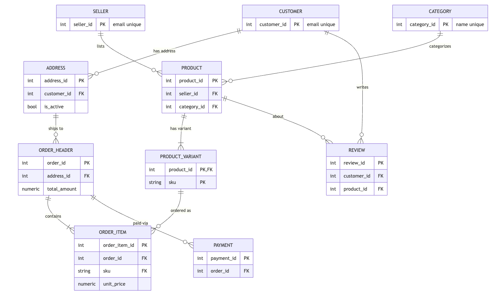
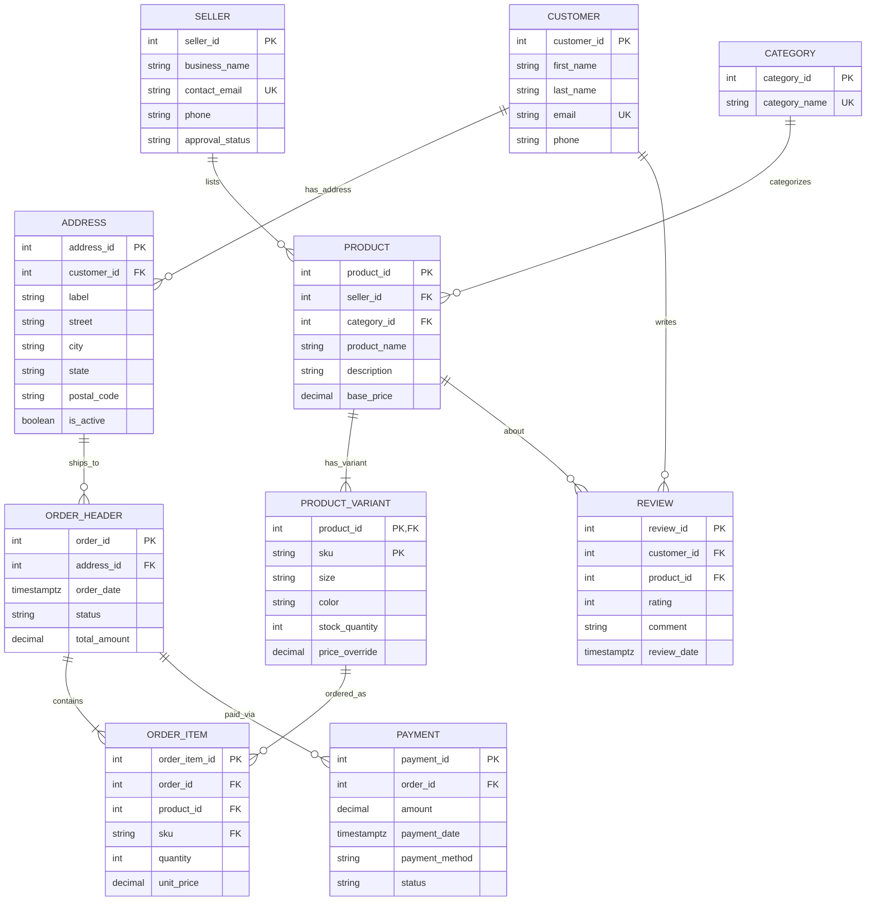
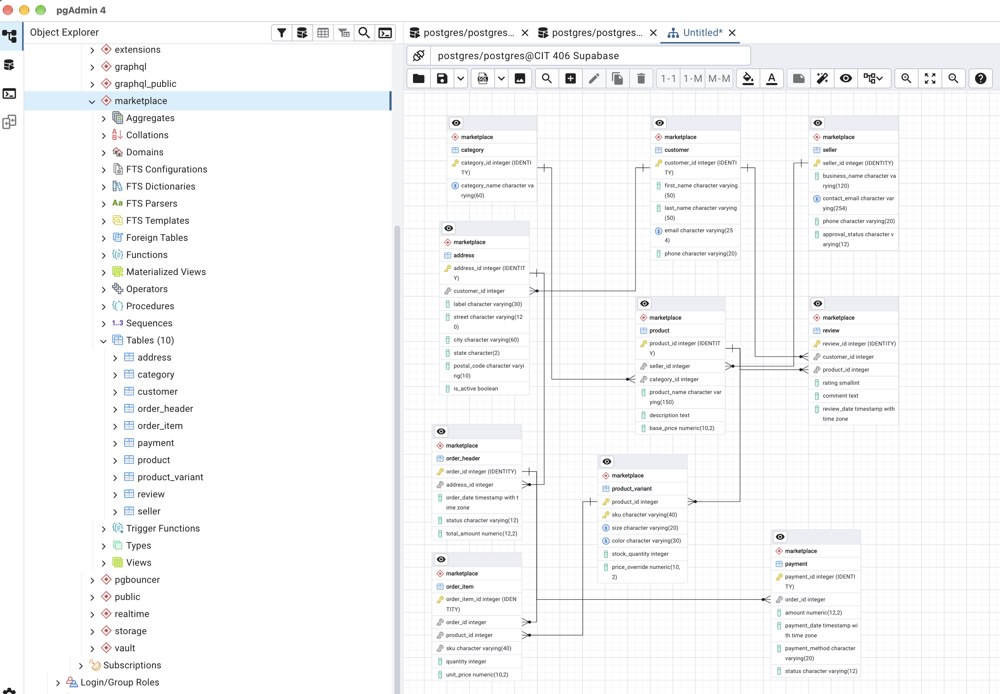

# Multi-Vendor Marketplace Database (PostgreSQL + Supabase)

A normalized (BCNF) PostgreSQL database for a multi-vendor e-commerce marketplace: sellers list products with variants, customers place orders shipped to saved addresses, pay in one or more payments, and review products.

The whole database can be rebuilt from this repository with two SQL files. It is the CIT 406 Database Design term project at Atlantis University (Fall "A" 2026).


---

## Contents

1. [What's in this repository](#whats-in-this-repository)
2. [Data model](#data-model)
3. [Prerequisites](#prerequisites)
4. [Setup: choose one option](#setup-choose-one-option)
   - [Option A: Supabase SQL Editor (easiest)](#option-a-supabase-sql-editor-easiest)
   - [Option B: pgAdmin 4 connected to Supabase](#option-b-pgadmin-4-connected-to-supabase)
   - [Option C: psql command line](#option-c-psql-command-line)
   - [Option D: local PostgreSQL with Docker](#option-d-local-postgresql-with-docker)
5. [Verify the build](#verify-the-build)
6. [View the schema diagram in Supabase](#view-the-schema-diagram-in-supabase)
7. [Referential actions and business rules](#referential-actions-and-business-rules)
8. [Example queries](#example-queries)
9. [Reset or remove the database](#reset-or-remove-the-database)
10. [Troubleshooting](#troubleshooting)
11. [Design notes](#design-notes)

---

## What's in this repository

```
.
├── schema.sql                  # Creates the "marketplace" schema: tables, keys, constraints, indexes
├── seed.sql                    # Loads sample data (safe to rerun)
├── docs/
│   ├── er-diagram.png          # ER diagram generated from the live schema, with referential actions
├── .gitignore
├── LICENSE                     # MIT
└── README.md
```

| File | What it does |
|---|---|
| `schema.sql` | Drops and recreates the `marketplace` schema with 10 tables, primary and alternate keys, CHECK constraints, foreign keys with explicit `ON DELETE` / `ON UPDATE` actions, and indexes on foreign-key columns. |
| `seed.sql` | Empties every table, inserts sample rows, resets the ID sequences, and prints a row count per table. |

Everything is created inside its own `marketplace` schema, so it never touches the default `public` schema or any other work in the same database.

---

## Data model



*Generated from the database catalog after running `schema.sql`. Each line runs from the parent (bar) to the child (crow's foot) and is labeled with its `ON DELETE / ON UPDATE` action: red for RESTRICT, green for CASCADE.*

The same relationships as a Mermaid diagram:



| Table | Primary key | Alternate key (UNIQUE) | Holds |
|---|---|---|---|
| `category` | category_id | category_name | Product categories |
| `seller` | seller_id | contact_email | Vendors and their approval status |
| `customer` | customer_id | email | Shoppers |
| `address` | address_id | — | A customer's saved shipping addresses |
| `product` | product_id | — | Catalog items, each owned by one seller |
| `product_variant` | (product_id, sku) | (product_id, size, color) | Sellable versions of a product with stock |
| `order_header` | order_id | — | One order, its shipping address, status and total |
| `order_item` | order_item_id | (order_id, product_id, sku) | Order lines with the price paid at checkout |
| `payment` | payment_id | — | Charges and refunds (an order can have several) |
| `review` | review_id | (customer_id, product_id) | One rating per customer per product |

**Two design points worth knowing before you query:**

- **Orders reach their customer through the address.** There is no `customer_id` on `order_header`; join `order_header → address → customer`. Storing both would break BCNF, because an address always belongs to one customer.
- **Used addresses are never edited.** When a customer changes or removes an address, a new row is added and the old one gets `is_active = FALSE`, so past orders keep showing where they actually shipped.

`order_header` is named that way because `ORDER` is a reserved SQL word.

---

## Prerequisites

| You need | For | Notes |
|---|---|---|
| A PostgreSQL **15 or newer** database | All options | Required for `UNIQUE NULLS NOT DISTINCT`. New Supabase projects already meet this. |
| A free [Supabase](https://supabase.com) account | Options A–C | Or use Docker for a fully local setup (Option D). |
| [pgAdmin 4](https://www.pgadmin.org/download/) | Option B only | |
| `psql` client | Option C only | Ships with PostgreSQL; on macOS `brew install libpq`. |
| [Docker](https://www.docker.com/) | Option D only | |
| Git | Getting the files | Or use **Code → Download ZIP** on GitHub. |

Get the files:

```bash
git clone https://github.com/iamwaqarjaved/cit406-marketplace-database.git
cd cit406-marketplace-database
```

---

## Setup: choose one option

Whichever option you pick, the rule is the same: **run `schema.sql` first, then `seed.sql`.**

### Option A: Supabase SQL Editor (easiest)

1. Sign in to Supabase and click **New project**. Pick a name, set a database password (save it), choose a region, and wait for the project to finish provisioning.
2. In the left sidebar, open **SQL Editor** and click **New query**.
3. Open `schema.sql` from this repo, copy all of it, paste it into the editor and click **Run**.
   You should see *Success. No rows returned.*
4. Open a new query, paste all of `seed.sql` and click **Run**.
   The results panel shows 10 rows, one per table (see [Verify the build](#verify-the-build)).

### Option B: pgAdmin 4 connected to Supabase

1. In Supabase, click **Connect** at the top of your project page and copy the connection details (host, port, database, user). The **Session pooler** connection works on every network; the direct connection needs IPv6.
2. In pgAdmin, right-click **Servers → Register → Server…**
   - **General → Name:** anything, e.g. `Marketplace (Supabase)`
   - **Connection:** paste the host, port, database (`postgres`), user and your database password
   - **Parameters:** set **SSL mode** to `require`
3. Expand the server, right-click the `postgres` database and choose **Query Tool**.
4. Click the folder icon, open `schema.sql`, and press **F5** (Execute).
5. Open `seed.sql` the same way and press **F5**.
6. Right-click **Schemas → Refresh**. You will now see `marketplace` with 10 tables.

### Option C: psql command line

Copy the connection string from Supabase (**Connect → Session pooler → URI**) and run:

```bash
export DATABASE_URL="postgresql://postgres.<project-ref>:<password>@<pooler-host>:5432/postgres"

psql "$DATABASE_URL" -v ON_ERROR_STOP=1 -f schema.sql
psql "$DATABASE_URL" -v ON_ERROR_STOP=1 -f seed.sql
```

`ON_ERROR_STOP=1` makes psql stop at the first error instead of carrying on.

### Option D: local PostgreSQL with Docker

No Supabase account needed:

```bash
docker run --name marketplace-db -e POSTGRES_PASSWORD=postgres \
  -p 5432:5432 -d postgres:16

# wait a few seconds for the server to start, then:
docker exec -i marketplace-db psql -U postgres -v ON_ERROR_STOP=1 < schema.sql
docker exec -i marketplace-db psql -U postgres -v ON_ERROR_STOP=1 < seed.sql

# open an interactive session
docker exec -it marketplace-db psql -U postgres
```

You can also connect pgAdmin to `localhost:5432`, user `postgres`, password `postgres`.

---

## Verify the build

The last query in `seed.sql` prints the row count of every table. You should see:

| table_name | row_count |
|---|---:|
| category | 5 |
| seller | 4 |
| customer | 5 |
| address | 7 |
| product | 7 |
| product_variant | 14 |
| order_header | 7 |
| order_item | 13 |
| payment | 8 |
| review | 6 |

To list every constraint that was created:

```sql
SELECT conrelid::regclass AS table_name,
       conname            AS constraint_name,
       pg_get_constraintdef(oid) AS definition
FROM   pg_constraint
WHERE  connamespace = 'marketplace'::regnamespace
ORDER  BY 1, 2;
```

To confirm every stored order total matches its lines (should return no rows):

```sql
SET search_path TO marketplace;

SELECT o.order_id, o.total_amount, SUM(i.quantity * i.unit_price) AS line_total
FROM   order_header o
JOIN   order_item i ON i.order_id = o.order_id
GROUP  BY o.order_id, o.total_amount
HAVING o.total_amount <> SUM(i.quantity * i.unit_price);
```

---

## View the schema diagram in Supabase

1. In the Supabase sidebar, open **Database → Schema Visualizer**.
2. Change the schema dropdown (top left) from `public` to **`marketplace`**.
3. Drag the tables apart until every relationship line is visible.



> The Table Editor only shows the `public` schema by default. Use its schema dropdown, or the SQL Editor, to browse `marketplace` tables.

---

## Referential actions and business rules

Every foreign key states both actions explicitly. `ON UPDATE NO ACTION` is used wherever the referenced key is a generated ID, because those never change.

| Foreign key | ON DELETE | ON UPDATE | Business rule |
|---|---|---|---|
| `address.customer_id` → `customer` | CASCADE | NO ACTION | An address book belongs to its customer and is removed with the account. If any of those addresses was used by an order, the RESTRICT on `order_header.address_id` blocks the whole delete. |
| `product.seller_id` → `seller` | RESTRICT | NO ACTION | A seller with listed products cannot be deleted. They are suspended through `approval_status` so their catalog history stays intact. |
| `product.category_id` → `category` | RESTRICT | NO ACTION | Every product must have a category. A category in use cannot be removed until its products are moved. |
| `product_variant.product_id` → `product` | CASCADE | NO ACTION | A variant cannot exist without its product (weak entity). Deleting an unsold product removes its variants. |
| `order_header.address_id` → `address` | RESTRICT | NO ACTION | An order must always show where it shipped and, through the address, who placed it. Used addresses are retired, not deleted. |
| `order_item.order_id` → `order_header` | CASCADE | NO ACTION | Order lines are part of their order. Deleting an abandoned, unpaid order removes its lines. |
| `order_item.(product_id, sku)` → `product_variant` | RESTRICT | **CASCADE** | A sold variant cannot be deleted. If a seller renames a SKU, the new SKU flows into past order lines automatically. |
| `payment.order_id` → `order_header` | RESTRICT | NO ACTION | Payments are financial records. An order with a payment is cancelled or refunded through its status, never deleted. |
| `review.customer_id` → `customer` | CASCADE | NO ACTION | A review belongs to its author and is removed with the customer account. |
| `review.product_id` → `product` | CASCADE | NO ACTION | If an unsold product is removed from the catalog, its reviews go with it. |

**The pattern:** CASCADE is used only where the child is part of its parent (addresses, variants, order lines, reviews). RESTRICT protects anything with business or financial history. When a cascade reaches a RESTRICT, the RESTRICT wins and the whole delete is rolled back.

### Try the actions yourself

Each statement below runs inside a transaction and is rolled back, so your data is unchanged.

```sql
SET search_path TO marketplace;

-- RESTRICT: fails, seller 1 has products
BEGIN; DELETE FROM seller WHERE seller_id = 1; ROLLBACK;

-- RESTRICT: fails, order 1001 has a payment
BEGIN; DELETE FROM order_header WHERE order_id = 1001; ROLLBACK;

-- CASCADE + RESTRICT: fails, customer 1's address was used by an order
BEGIN; DELETE FROM customer WHERE customer_id = 1; ROLLBACK;

-- CASCADE: succeeds, removes Liam's saved address with his account
BEGIN;
DELETE FROM customer WHERE customer_id = 5;
SELECT COUNT(*) AS liam_addresses FROM address WHERE customer_id = 5;  -- 0
ROLLBACK;

-- ON UPDATE CASCADE: renaming a SKU updates past order lines
BEGIN;
UPDATE product_variant SET sku = 'EB-BLK-V2' WHERE product_id = 1 AND sku = 'EB-BLK';
SELECT order_item_id, sku FROM order_item WHERE order_item_id = 1;     -- EB-BLK-V2
ROLLBACK;
```

In the Supabase SQL Editor, run the failing examples one at a time: the editor stops at the first error.

---

## Example queries

All examples assume `SET search_path TO marketplace;` has been run in the session.

**A customer's order history** (joins through the shipping address):

```sql
SELECT o.order_id, o.order_date::date, o.status, o.total_amount
FROM   order_header o
JOIN   address a ON a.address_id = o.address_id
WHERE  a.customer_id = 2
ORDER  BY o.order_date DESC;
```

**Revenue per seller** (paid, shipped and delivered orders only):

```sql
SELECT s.business_name, SUM(i.quantity * i.unit_price) AS revenue
FROM   order_item i
JOIN   order_header o ON o.order_id  = i.order_id
JOIN   product      p ON p.product_id = i.product_id
JOIN   seller       s ON s.seller_id  = p.seller_id
WHERE  o.status IN ('paid', 'shipped', 'delivered')
GROUP  BY s.business_name
ORDER  BY revenue DESC;
```

**Variants running low on stock:**

```sql
SELECT p.product_name, v.sku, v.size, v.color, v.stock_quantity
FROM   product_variant v
JOIN   product p ON p.product_id = v.product_id
WHERE  v.stock_quantity < 30
ORDER  BY v.stock_quantity;
```

**Average rating per product:**

```sql
SELECT p.product_name, ROUND(AVG(r.rating), 1) AS avg_rating, COUNT(*) AS reviews
FROM   review r
JOIN   product p ON p.product_id = r.product_id
GROUP  BY p.product_name
ORDER  BY avg_rating DESC, p.product_name;
```

**Net amount paid per order** (completed payments minus refunds):

```sql
SELECT o.order_id, o.total_amount,
       COALESCE(SUM(py.amount) FILTER (WHERE py.status = 'completed'), 0)
     - COALESCE(SUM(py.amount) FILTER (WHERE py.status = 'refunded'),  0) AS net_paid
FROM   order_header o
LEFT   JOIN payment py ON py.order_id = o.order_id
GROUP  BY o.order_id, o.total_amount
ORDER  BY o.order_id;
```

### What the sample data shows

| Scenario | Where to look |
|---|---|
| An order shipped to an address the customer later retired | Order 1003 → address 4 (`is_active = FALSE`) |
| A refund recorded as a second payment | Order 1005 → payments 5 and 6 |
| One order paid with a gift card plus a card | Order 1007 → payments 7 and 8 |
| An order not yet paid | Order 1006 (`pending`, no payment) |
| A line sold below the current price | Order item 9: earbuds at 54.99 vs. 59.99 base price |
| A seller awaiting approval, with no products | Seller 4, Metro Threads |
| A category with no products yet | Category 5, Books |
| A customer with no orders | Customer 5, Liam Johnson |

---

## Reset or remove the database

- **Reload sample data only:** rerun `seed.sql`. It empties every table first.
- **Rebuild from scratch:** rerun `schema.sql`, then `seed.sql`.
- **Remove everything this project created:**

  ```sql
  DROP SCHEMA marketplace CASCADE;
  ```

  This deletes only the `marketplace` schema. Nothing else in the database is affected.

---

## Troubleshooting

| Problem | Cause and fix |
|---|---|
| `syntax error at or near "NULLS"` | Your server is older than PostgreSQL 15. Check with `SELECT version();` and use a newer server (all current Supabase projects qualify). |
| `relation "category" does not exist` when running `seed.sql` | `schema.sql` has not been run yet, or ran in a different database. Run it first, against the same connection. |
| `relation "product" does not exist` in your own queries | The tables are in the `marketplace` schema. Run `SET search_path TO marketplace;` or write `marketplace.product`. |
| pgAdmin cannot connect to Supabase | Use the **Session pooler** host from **Connect**, set SSL mode to `require`, and check the password (reset it under **Project Settings → Database** if needed). |
| Schema Visualizer shows no tables | Switch the schema dropdown from `public` to `marketplace`. |
| `duplicate key value violates unique constraint ..._pk` when adding rows yourself | You supplied an explicit ID that already exists. Leave the ID column out so the identity sequence generates one. |
| Supabase warns that RLS is disabled | That warning applies to tables in `public`, which the Supabase API exposes. This project uses its own `marketplace` schema, which the API does not expose by default. |

---

## Design notes

This schema is the physical implementation of a design normalized to **Boyce-Codd Normal Form**:

- **The one decomposition:** the ERD's `ORDER` held both `customer_id` and `address_id`. Because `address_id → customer_id`, the customer column was removed and is reached through the address.
- **Controlled denormalization:** `order_header.total_amount` stores the checkout total (the amount the customer agreed to and payments reconcile against), even though it can be derived from `order_item`. `address` keeps `city` and `state` beside `postal_code`, because a ZIP code does not reliably determine a single city.
- **`unit_price` is not redundant:** it records the price at the time of sale, which can differ from the variant's current price.

**Physical choices:**

- Identity keys: `GENERATED BY DEFAULT AS IDENTITY`.
- Money: `NUMERIC(10,2)` / `NUMERIC(12,2)`, never floating point.
- Timestamps: `TIMESTAMPTZ` with `now()` defaults.
- CHECK constraints: statuses, ratings, quantities, prices, state codes and ZIP formats.
- Indexes on every foreign-key column that is not already the leading column of a primary or unique key.

---

## Author

**Waqar Javed** · CIT 406: Database Design (Fall "A" 2026), Atlantis University · Instructor: Anshu Sharma
